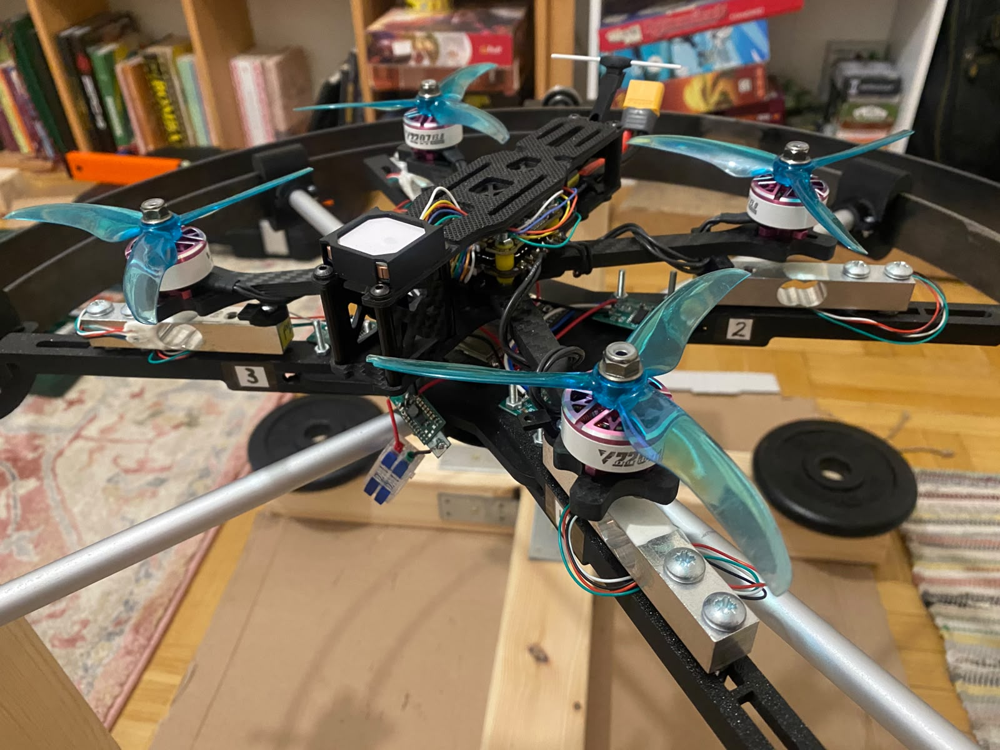
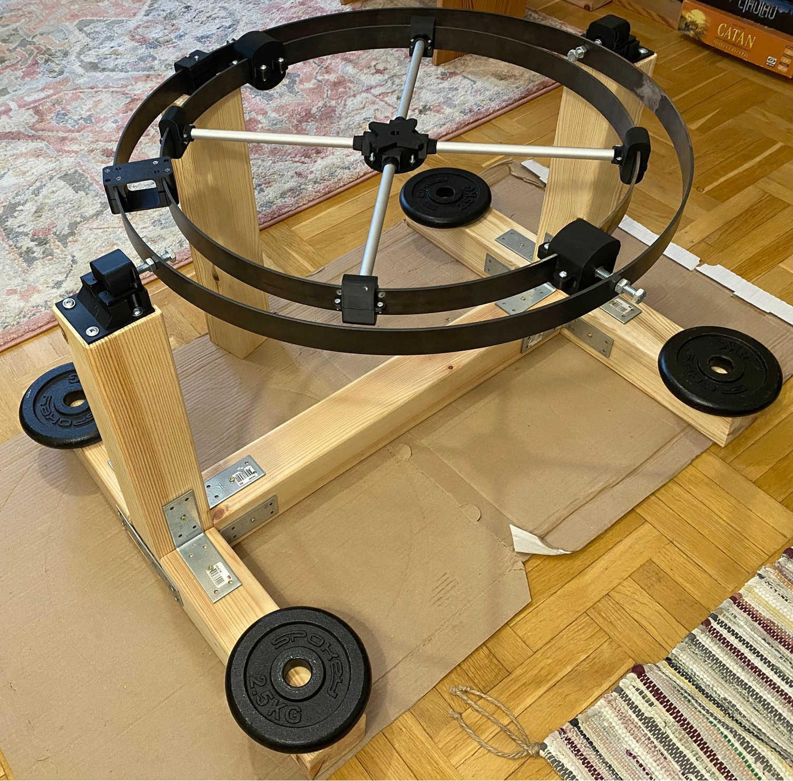
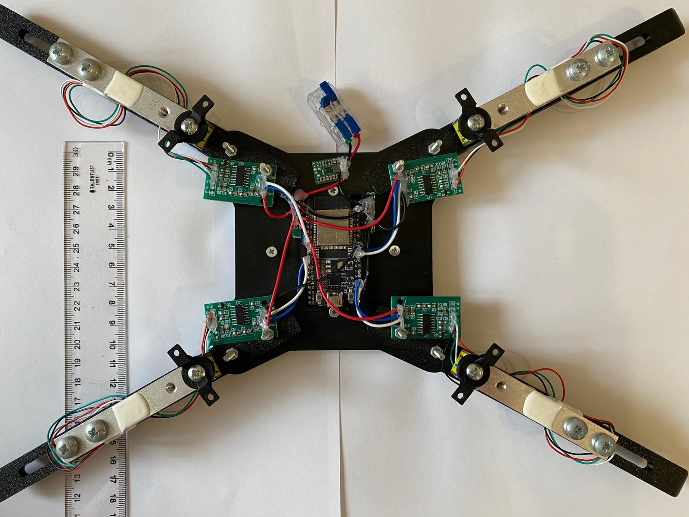
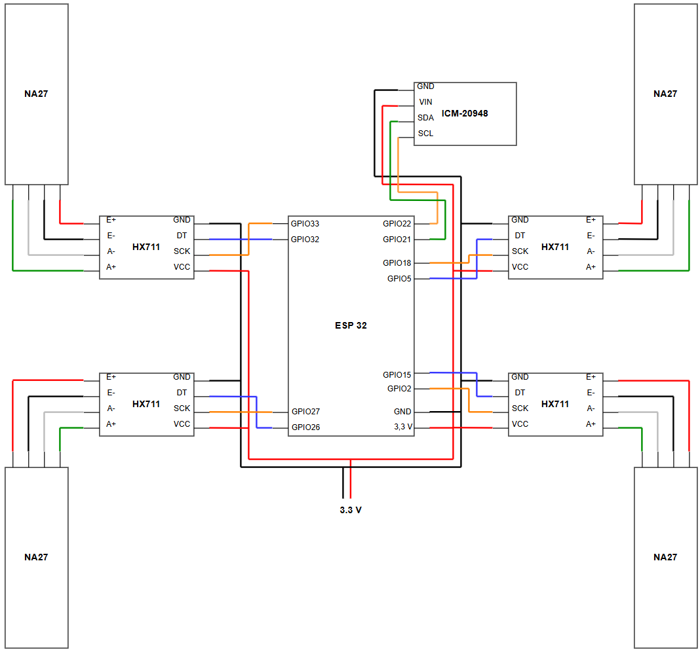
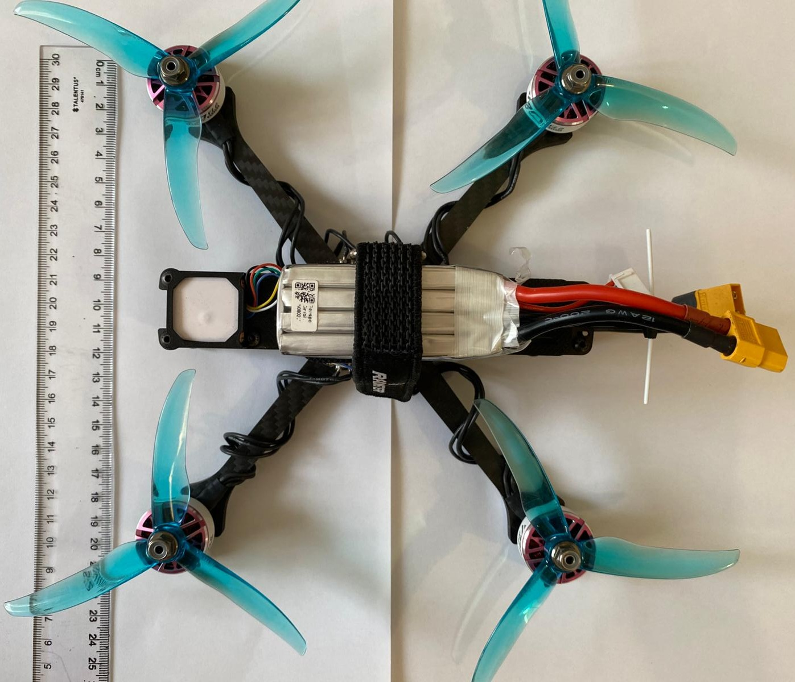
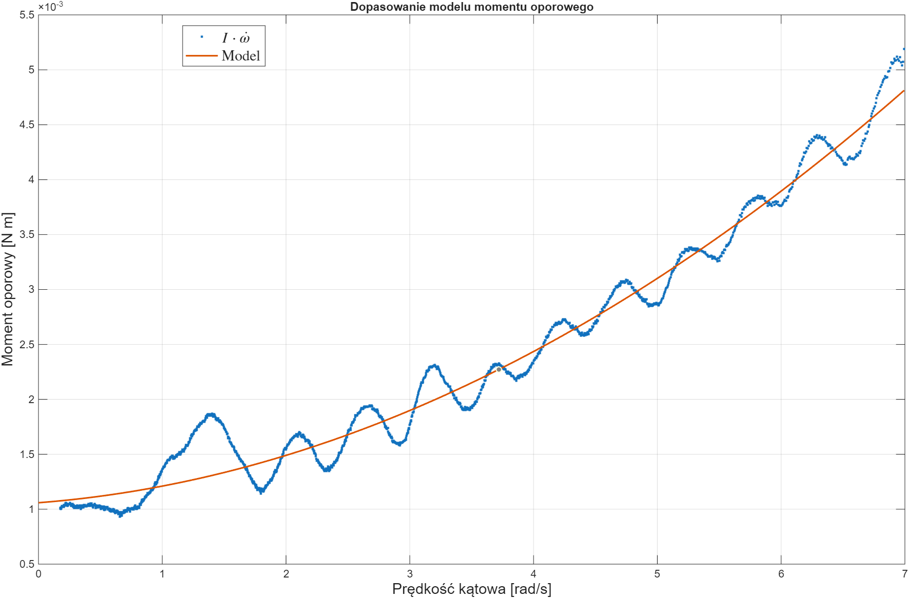

# Introduction
The repository contains code, scripts, CAD files in .step format, and other elements used in the development of a test platform for quadcopter drones and a quadcopter model.

    

# Test platform

The test platform that was built allowed for the testing of quadcopter drones in a safe environment. The measurement system, located at the center, enabled the measurement of the drone’s basic parameters: thrust generated by the propulsion units using strain gauges, and linear accelerations and angular velocities using an IMU sensor. The structure itself was of the gyroscopic type, with a wooden base and metal rings. The individual components were connected using custom-designed and 3D-printed parts. The *.step* files are located in the [3D_print/platform](3D_print/platform) folder.

    

# Measurement system

At the center of the platform was a measurement system—designed and built—that allowed for the measurement of the drone’s thrust, as well as linear accelerations and angular velocities. The photos below show the finished component and a simplified diagram of the electrical connections. At the heart of the system was an ESP-32 microcontroller with a Wi-Fi module. It was used to acquire data from the sensors and transmit it to a computer using the UDP protocol. NA27 strain gauge beams with HX711 amplifiers were used to measure thrust, while the IMU sensor used was the SparkFun SEN-15335. The [measurement_system](measurement_system) folder contains a *platformio* project that implements the functionalities listed above.

    

    

# Drone
Part of the project involved building a quadcopter model. Commercially available components were used for this purpose. The completed drone is shown in the figure below. The 3D-printed parts are located in the [3D_print/drone](3D_print/drone) folder.
List of used components:
- FC SpeedyBee F405 V4 
- ESC SpeedyBee 55A
- GNSS SpeedyBee bzgnss-bz-251-gps
- BLDC engines 2550KV T-Motor Velox V3.0 V2207
- Receiver BETAFPV ELRS Nano ExpressLRS 2.4G
- Propeller T-Motor T-5143S
- Battery Tattu R-Line V4.0 4S 1550mAh 14.8V 130C XT60

A RadioMaster Pocket remote controller was used for remote control

    

# Analiza danych
The *[Simulink](simulink/data_read.slx)* model was used to retrieve data from the platform. The data was analyzed using scripts located in the [matlab](Matlab) folder. Some of the data used in this work is located in the [data](data) fold

    

